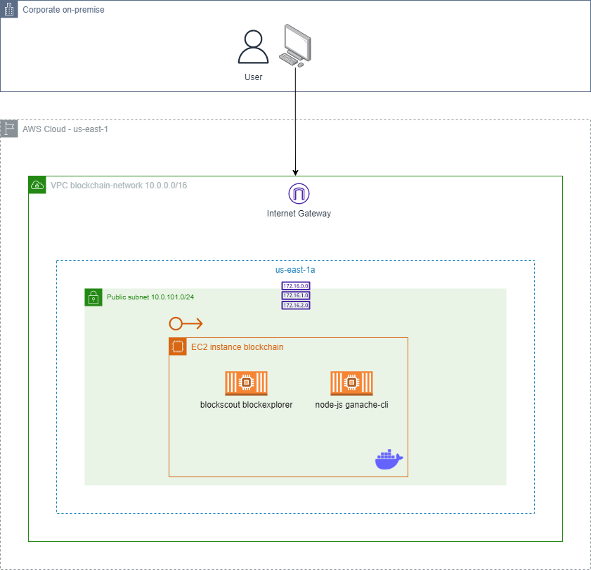
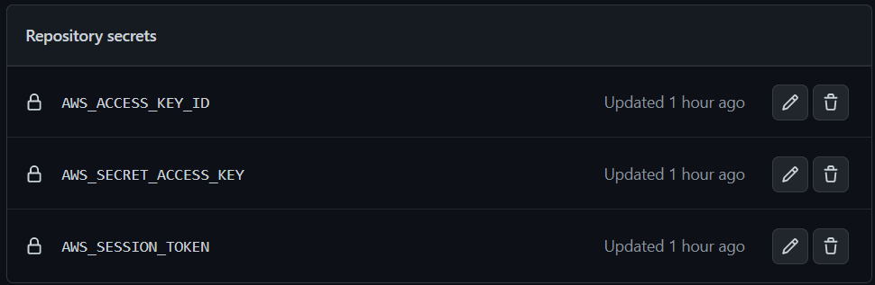
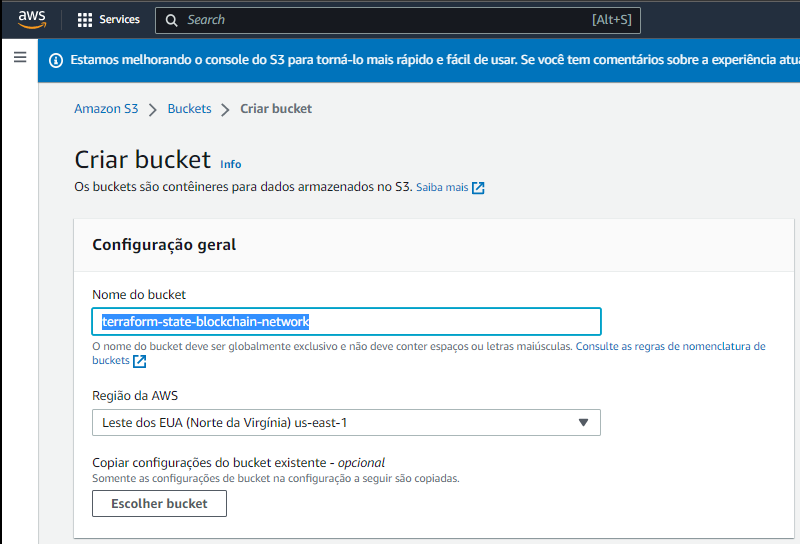

# Digital Product Bootcamp Blockchain

The project aims to provision a **non-mining blockchain testnet based on the Ethereum virtual machine (EVM)** with a backend service exposing the RPC APIs for interaction and a frontend blockexplorer application for monitoring the network using an EC2 instance using the Amazon Linux ISO with size t3.medium and Docker Compose to upload both applications:

## Digital Product Bootcamp EC2 IaC

This terraform repository aims to provision the necessary configurations on the EC2 instance to run blockchain and blockexplorer applications via Docker compose, with applications accessible via ports `4000` and `8545` using Elastic IP.

## How to begin

### Configuring the AWS Cloud Provider

1. Enter the AWS account credentials in the GitHub Secrets of this repository (Settings -> Secrets -> Actions):

2. Create an s3 bucket in region `us-east-1` with the name described in the backend.tf file (example `terraform-state-blockchain-network`):

## Development in this repository

This repository uses GitHub Actions for the CD/CI stream. Following the settings in the main branch (Settings -> Code and automation, Branchs -> Branc protection rules, main):

1. **Require a pull request before merging**
When enabled, all commits must be made to a non-protected branch and submitted via a pull request before they can be merged into a branch that matches this rule.

2. **Require status checks to pass before merging (for action terraform-validate)**
Choose which status checks must pass before branches can be merged into a branch that matches this rule. When enabled, commits must first be pushed to another branch, then merged or pushed directly to a branch that matches this rule after status checks have passed.

3. **Require branches to be up to date before merging**
This ensures pull requests targeting a matching branch have been tested with the latest code. This setting will not take effect unless at least one status check is enabled (see below).

### project folder structure

The project contains two main folders, separating the terraform HCL source code that provisions the EC2 instance with the security group, Elastic Ip and ansible files:

1. 01-tf
2. 02-ansible

As soon as the terraform apply command is applied inside the `01-tf` folder, the necessary files are dynamically generated with the information of the new EC2 instance created for the execution of ansible and docker compose in the `02-ansible` folder (dynamic files generated in the `01-tf/local_files_ansible.tf`).

### Branch feature/***

For the development of new features, create a branch following the pattern: `feature/***` and perform the pull that will perform the initial configuration of terraform validations using the action `.github/validate-terraform.yml`. At the end of the validation, the pull request to the main branch is automatically performed.

### Branch main

When approving an automatically opened pull request, the `.github/apply-destroy-terraform.yml` action is triggered. Which checks whether terraform should be applied (contents of the `destroy.yml` file with the content `destroy: false`) or destroyed (contents of the `destroy.yml` file with the content `destroy: true`).

With the pipeline execution without destruction, after all the steps are successful, open the terraform apply step in actions to find the elastic ip generated for the instance:

     